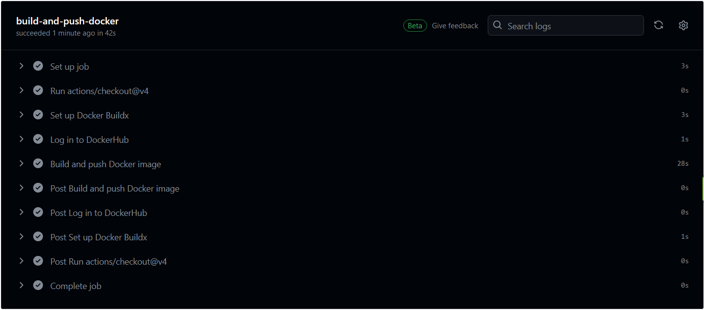
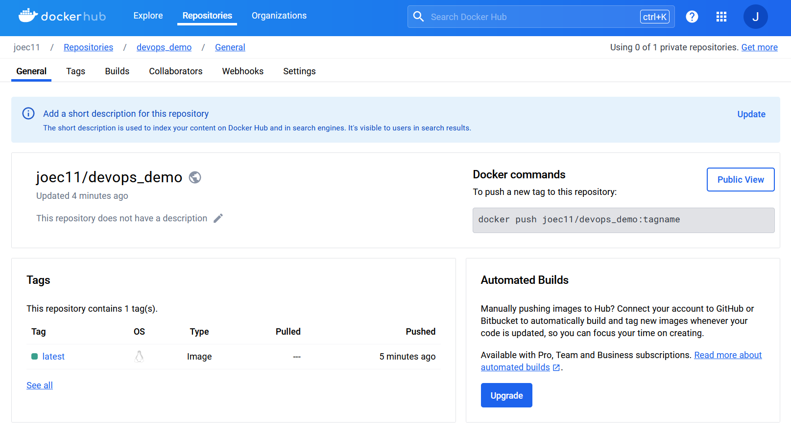

# Homework 8

## Build and push a docker image to DockerHub from GitHub using GitHub Actions

## Create a DockerHub repository from GitHub after using GitHub Actions to build and push a docker image to DockerHub

## Link to the DockerHub repository and the docker image
https://hub.docker.com/r/joec11/devops_demo/tags
